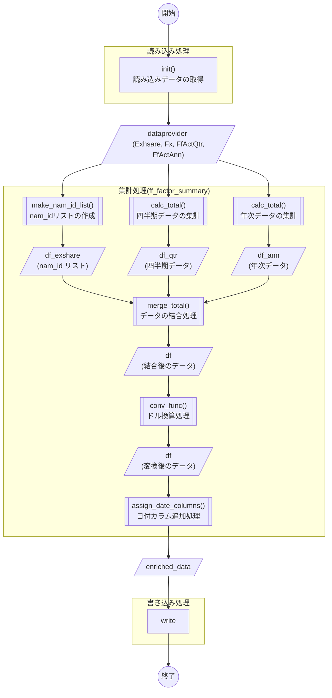

## ff_factor_summary

```mermaid
graph TD

start((開始))
ed((終了))


subgraph reader [読み込み処理]
  init["init() <br> 読み込みデータの取得"]
end

subgraph writer[書き込み処理]
  write
end

subgraph calc["集計処理(ff_factor_summary)       "]
  df_exshare[/"df_exshare <br> (nam_id リスト)"/]
  df_qtr[/"df_qtr <br> (四半期データ)"/]
  df_ann[/"df_ann <br> (年次データ)"/]
  df_merge[/"df <br> (結合後のデータ)"/]
  df_conv[/"df <br> (変換後のデータ)"/]

  make_nam_id_list[["make_nam_id_list() <br> nam_idリストの作成"]]
  calc_total1[["calc_total() <br> 四半期データの集計"]]
  calc_total2[["calc_total() <br> 年次データの集計"]]
  merge_total[["merge_total() <br> データの結合処理"]]
  conv[["conv_func() <br> ドル換算処理"]]
  assign_date_columns[["assign_date_columns() <br> 日付カラム追加処理"]]

end


dataprovider[/"dataprovider <br> (Exhsare, Fx, FfActQtr, FfActAnn)"/]
enriched_data[/enriched_data/]


start --> init
init --> dataprovider
dataprovider --> make_nam_id_list --> df_exshare
dataprovider --> calc_total1 --> df_qtr
dataprovider --> calc_total2 --> df_ann

df_exshare & df_qtr & df_ann --> merge_total 
merge_total --> df_merge
df_merge --> conv --> df_conv
df_conv --> assign_date_columns --> enriched_data
enriched_data --> write
write --> ed


```
