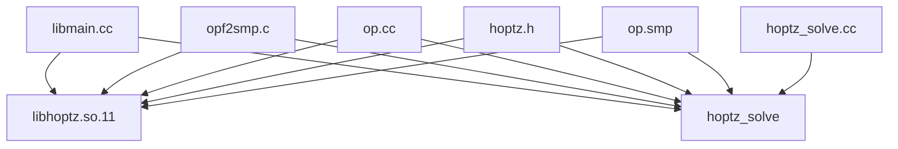
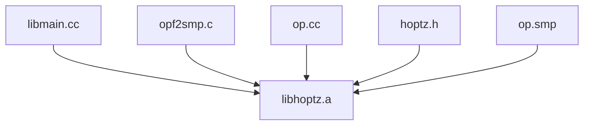
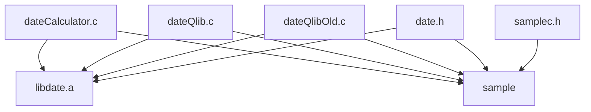
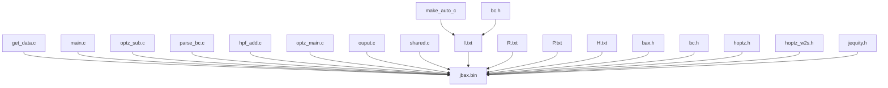
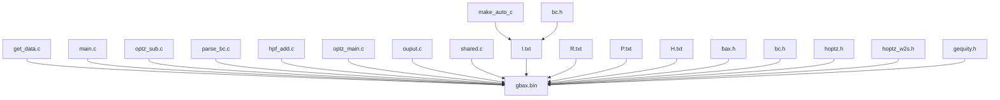
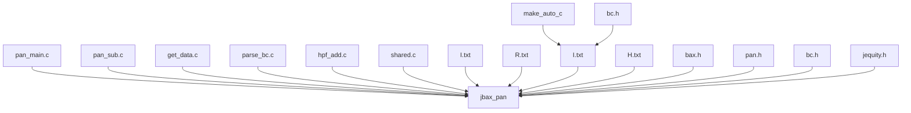

# test
# https://mermaid-js.github.io/mermaid-live-editor/#/

## libhoptz
動的ライブラリ生成

```mermaid
graph TD;
    A[libmain.cc]-->libhoptz.so.11;
    B[opf2smp.c]-->libhoptz.so.11;
    C[op.cc]-->libhoptz.so.11;
    D[hoptz.h]-->libhoptz.so.11;
    E[op.smp]-->libhoptz.so.11;

    A[libmain.cc]-->hoptz_solve;
    B[opf2smp.c]-->hoptz_solve;
    C[op.cc]-->hoptz_solve;
    D[hoptz.h]-->hoptz_solve;
    E[op.smp]-->hoptz_solve;
    F[hoptz_solve.cc]-->hoptz_solve;
```

静的ライブラリ生成

```mermaid
graph TD;
    A[libmain.cc]-->libhoptz.a;
    B[opf2smp.c]-->libhoptz.a;
    C[op.cc]-->libhoptz.a;
    D[hoptz.h]-->libhoptz.a;
    E[op.smp]-->libhoptz.a;

```

## lib_date

```mermaid
graph TD;
    A[dateCalculator.c]-->libdate.a;
    B[dateQlib.c]-->libdate.a;
    C[dateQlibOld.c]-->libdate.a;
    D[date.h]-->libdate.a;

    A[dateCalculator.c]-->sample;
    B[dateQlib.c]-->sample;
    C[dateQlibOld.c]-->sample;
    D[date.h]-->sample;
    E[samplec.h]-->sample;

```

## bax
jbax

```mermaid
graph TD;
    A[get_data.c]-->jbax.bin;
    B[main.c]-->jbax.bin;
    C[optz_sub.c]-->jbax.bin;
    D[parse_bc.c]-->jbax.bin;
    E[hpf_add.c]-->jbax.bin;
    F[optz_main.c]-->jbax.bin;
    G[ouput.c]-->jbax.bin;
    H[shared.c]-->jbax.bin;
    I[I.txt]-->jbax.bin;
    J[R.txt]-->jbax.bin;
    K[P.txt]-->jbax.bin;
    L[H.txt]-->jbax.bin;
    M[bax.h]-->jbax.bin;
    N[bc.h]-->jbax.bin;
    O[hoptz.h]-->jbax.bin;
    P[hoptz_w2s.h]-->jbax.bin;
    Q[jequity.h]-->jbax.bin;

    sh[make_auto_c]-->I[I.txt];
    header[bc.h]-->I[I.txt];
```

gbax

```mermaid
graph TD;
    A[get_data.c]-->gbax.bin;
    B[main.c]-->gbax.bin;
    C[optz_sub.c]-->gbax.bin;
    D[parse_bc.c]-->gbax.bin;
    E[hpf_add.c]-->gbax.bin;
    F[optz_main.c]-->gbax.bin;
    G[ouput.c]-->gbax.bin;
    H[shared.c]-->gbax.bin;
    I[I.txt]-->gbax.bin;
    J[R.txt]-->gbax.bin;
    K[P.txt]-->gbax.bin;
    L[H.txt]-->gbax.bin;
    M[bax.h]-->gbax.bin;
    N[bc.h]-->gbax.bin;
    O[hoptz.h]-->gbax.bin;
    P[hoptz_w2s.h]-->gbax.bin;
    Q[gequity.h]-->gbax.bin;

    sh[make_auto_c]-->I[I.txt];
    header[bc.h]-->I[I.txt];
```

jbax_pan

```mermaid
graph TD;
    A[pan_main.c]-->jbax_pan;
    B[pan_sub.c]-->jbax_pan;
    C[get_data.c]-->jbax_pan;
    D[parse_bc.c]-->jbax_pan;
    E[hpf_add.c]-->jbax_pan;
    F[shared.c]-->jbax_pan;
    G[I.txt]-->jbax_pan;
    H[R.txt]-->jbax_pan;
    I[P.txt]-->jbax_pan;
    J[H.txt]-->jbax_pan;
    K[bax.h]-->jbax_pan;
    L[pan.h]-->jbax_pan;
    M[bc.h]-->jbax_pan;
    O[jequity.h]-->jbax_pan;

    sh[make_auto_c]-->I[I.txt];
    header[bc.h]-->I[I.txt];
```
